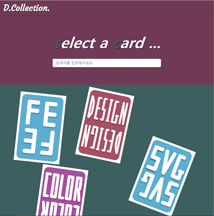
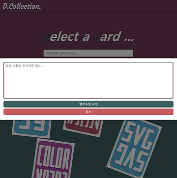
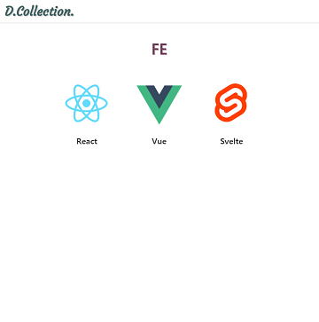
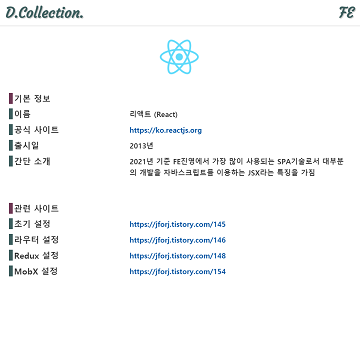

# D.Collection. (Development Collection)

## 스터디 주제
내가 실제로 사용할 페이지를 만들어보기

## 개발 주제
개발할 때 사용되는 유용한 사이트들을 모아놓은 페이지

## 개발하게 된 계기
여러 사이트들을 메모장에 정리하지 않고 어디서든 확인할 수 있도록 하기 위해 개발

## 기술스택 (FE)
* Svelte
* TypeScript
* Scss

## 배포
* Netlify

## 도메인
<a href="https://ksc-dcollection.netlify.app">https://ksc-dcollection.netlify.app</a>

## 구현 화면

### 메인 페이지

### 정보 수정 이메일 기능

### 카드 페이지

### 세부 정보 페이지
