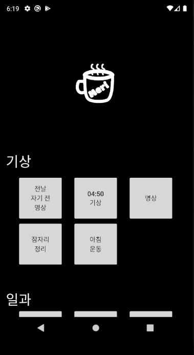
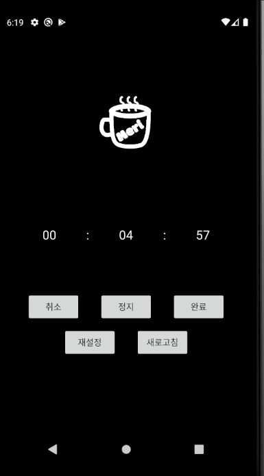
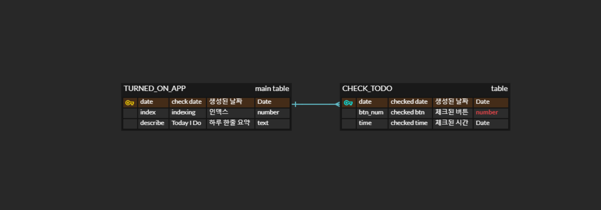

# Must To Do App

### 🚩&nbsp; 나에게 필요한 소프트웨어 만들기

&nbsp;

> Must TODO App  
> 내가 항상 해야하는, 습관으로 만들고 싶은  
> 목록들을 정리해두고 달성 할 수 있도록 돕는 어플리케이션

&nbsp;

### 🛠 &nbsp;Stack

&nbsp;

### splash(앱 시작시 로딩) 페이지

### main 페이지

### 명상용 타이머 페이지

### main 페이지 버튼 클릭시 sqlite에 정보 저장 (달성도 체크)

### 🚑 &nbsp;프로젝트 Summary

첫 코틀린 프로젝트  
토이 프로젝트로 나에게 필요한 서비스를 만드려 할때  
새로운 언어도 배울겸 코틀린을 선택했다.  
~~프로젝트 도중 아이폰으로 바꿔서 실제로 사용은 한번도 못해봤다~~  
앱이 어떻게 만들어지고, 배우는데 나름 재미도 있었다.  
기왕이면 오래 사용했던 Java를 사용하지 않고  
안드로이드 스튜디오를 한번쯤은 해보고 싶었는데,  
이번 기회를 통해 재밌게 만들어 볼 수 있었다.
